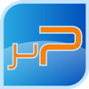

# uPLibrary

uPLibrary is an helper library composed of managed drivers for common hardware that you can interface to your .Net Micro Framework board and some other useful components.

*Project Description*

uPLibrary is an helper library composed of managed drivers for common hardware that you can interface to your .Net Micro Framework board and some other useful components.

Managed Drivers :

* Lcd : class for compatible Hitachi HD4478U controller LCD display using GPIO provider or ShiftRegister provider
* ShiftRegister74HC595 : class for shift register NXP 74HC595
* Pir : class for Passive Infrared Sensor (for motion detect)
* Ultrasonic : class for Ultrasonic Sensor (for object distance measurement)
* TMP102 : class for Texas Instruments low power digital temperature sensor TMP102
* DS1307 : class for Maxim RTC (Real Time Clock) device
* SHT1X : class for SHTX1X temperature and humidity sensor
* Anemometer : class for a generic anemometer
* TB6612FNG : class for a dual motor driver

Utilities :

* Utility : class with some utility methods
* Encoder : class for Base64 encoding

Networking :

* Ddns : some classes that build a software component for Dynamic DNS service provider functionality (No-IP and DynDns supported)
* Smtp : some classes that build a software component for sending emails via SMTP server
* Wol : class that implements Wake On LAN functionality
* Http : HttpClient for connecting to HTTP server. It's usefull for RESTful services connection.

Internet Of Things :

* ThingSpeak : ThingSpeakClient class with Internet of Things client for ThingSpeak platform (http://www.thingspeak.com)

The project is also available as package on Nuget [here](http://www.nuget.org/packages/uPLibrary/) but you can download it from Visual Studio, using Nuget Package Manager.
